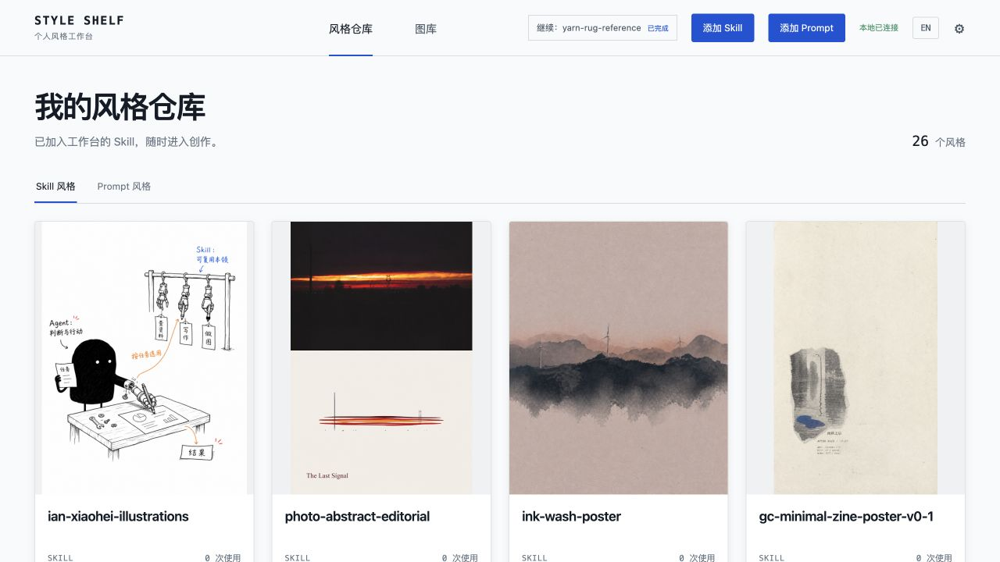
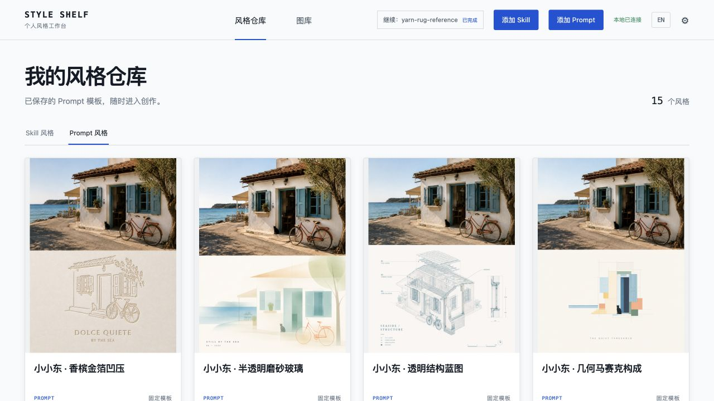
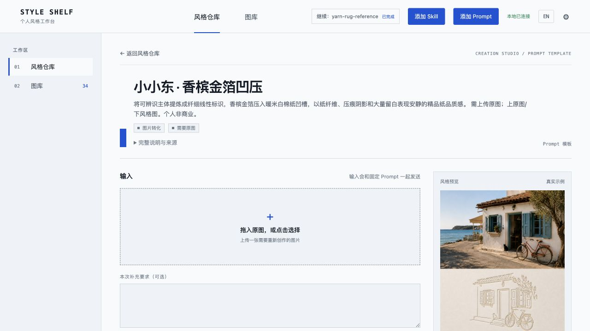
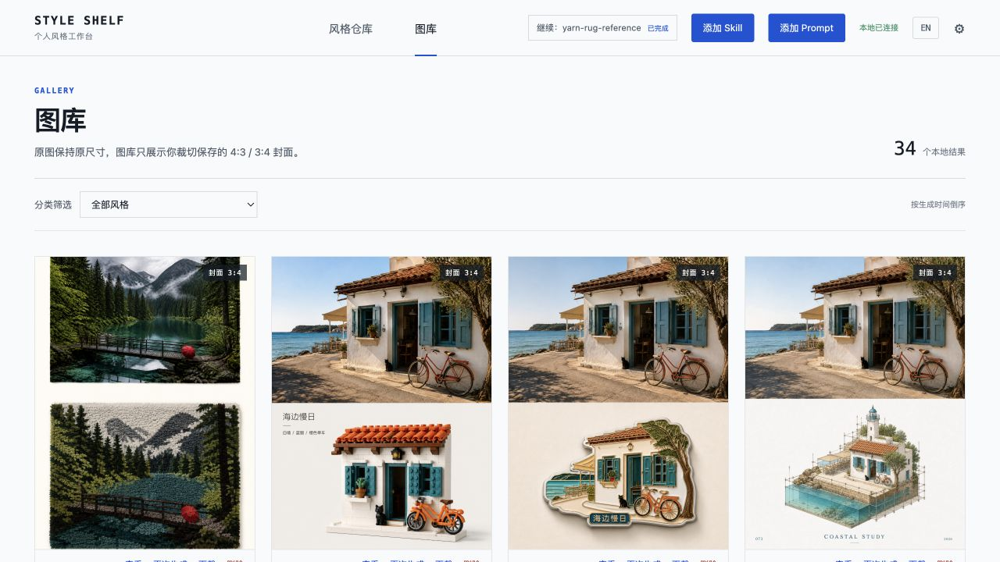

<p align="center">
  
</p>

<p align="center">
  <a href="#界面与效果">看界面</a> · <a href="#从源码运行">开始使用</a> · <a href="README.en.md">English</a>
</p>

收藏喜欢的做图方式，选一张风格卡片，上传图片或写下想法，再把满意的结果留在自己的图库里。

## 界面与效果

以下是维护者本地工作台的真实截图，展示自行添加内容后的使用效果。**截图中的 Skill、Prompt 和作品用于界面演示，不随软件内置；新安装从空白工作台开始。**

### 01 · 按效果选择风格

把自己收藏的 Skill 整理成可视卡片，查看效果、来源和输入要求，再进入创作。



### 02 · 把常用 Prompt 留在手边

同一张照片，可以有不同的表达。Prompt 独立收藏、编辑与复用，封面可选完整展示或铺满裁切。



### 03 · 在一个工作区里完成创作

提供原图、补充要求、选择比例；生成后可以在同一任务中继续修改，保留每轮结果。



### 04 · 把结果收进本地图库

浏览与筛选自己的作品。展示封面的裁切与原图分开保存，需要时仍能取回完整图片。



## Style Shelf 做什么

- **按效果找风格**：用封面和说明浏览 Skill，不需要记住包名。
- **同时管理两种机制**：Skill 与 Prompt 分区保存、分区浏览，但共用创作工作区和图库。
- **适配不同输入**：根据来源显示图片、文字、多图、比例、选项或引导问答。
- **保留完整过程**：并行运行本地 Job，保留每轮结果，并在同一 Job 上继续修改。
- **本地保存作品**：原图与 `4:3` / `3:4` 展示封面分开保存，用户数据不会打进安装包。
- **安全管理 Skill**：可从 Codex Skill 目录导入或从 GitHub 安装；移出工作台不会删除原始 Skill。

### 寻找图片生成 Skill

Style Shelf 默认不内置 Skill。你可以前往 [Awesome Codex ImageGen Skills](https://github.com/tuteng0915/Awesome-Codex-ImageGen-Skills) 浏览带真实生成示例的社区 Skill，并从各 Skill 的原作者仓库安装。该目录是独立的第三方项目；安装前请检查每个 Skill 的来源、许可证与使用限制。

## 工作流程

1. **选择来源** — 从 Skill 风格或 Prompt 风格中选择一张卡片。
2. **提供输入** — 按需要上传图片、填写文字，或两者都提供。
3. **本地执行** — 通过 Codex 运行；WorkBuddy 连接作为可选后端保留。
4. **保存结果** — 继续修改当前 Job，或把满意版本发布到本地图库。

## 快速开始

### 下载桌面版

当前版本为 **0.2.3 纯工作台**：安装后从空白目录开始，不内置 Skill、Prompt 或样例图片。

前往 [最新 Release](https://github.com/logic0512/style-shelf/releases/latest)，选择对应系统：

- macOS：`Style-Shelf-0.2.3-mac-universal.dmg`，同时支持 Intel 与 Apple 芯片。
- Windows：`Style-Shelf-0.2.3-win-x64.exe`。
- Linux：`Style-Shelf-0.2.3-linux-x86_64.AppImage`。

当前安装包尚未签名或公证。macOS 可能需要在“系统设置 → 隐私与安全性”中允许打开，Windows 可能显示 SmartScreen 提示。

### 从源码运行

需要 Node.js `22.12+`：

```bash
git clone https://github.com/logic0512/style-shelf.git
cd style-shelf
npm install
npm run bootstrap
npm run start
```

打开 <http://127.0.0.1:4173>。`bootstrap` 会初始化本地目录、运行环境诊断，不自动添加 Skill 或 Prompt，已有用户数据保留。

常用命令：

```bash
npm run doctor
npm test
npm run build
npm run desktop
```

## 执行方式与已知边界

### Codex（默认）

- 需要本机安装并登录 Codex，且当前账户具有可用的生图能力。
- Style Shelf 保存 Job、来源引用、输入副本和结果文件，不保存 Codex 登录凭据。
- Skill 与 Prompt 流程均已接入 Codex 执行路径。

### WorkBuddy（可选）

- 需要单独启动 WorkBuddy 本地 HTTP 服务，并在 WorkBuddy 内配置图像模型 API。
- 当前只完成连接与结果接收边界，尚未用可用的第三方生图 API 做端到端验证。
- 详见 [WorkBuddy 连接说明](docs/WORKBUDDY_CONNECTION_TEST.md)。

Prompt 模板保存在 `<data-dir>/prompts.json`，不会生成或修改 `SKILL.md`。服务默认只监听 `127.0.0.1`，安装包不包含用户图片、历史 Job、`.env` 或模型密钥。仓库中的界面截图仅用于展示，不包含可导入的 Skill、Prompt 正文或任务数据。

## 本地存储与隐私

- 上传副本：`~/Pictures/Style Shelf/Uploads/`
- 生成原图：`~/Pictures/Style Shelf/Generated/`
- 内部 Job 与索引：Web 模式默认使用 `.styleshelf-data/`；App 模式使用系统用户数据目录。

路径可以通过 `.env` 覆盖，示例见 [`.env.example`](.env.example)。不要把 `.env`、登录信息或密钥提交到仓库。

## 更多文档

- [贡献说明](CONTRIBUTING.md)
- [隐私与凭据边界](docs/PRIVACY.md)
- [故障排查](docs/TROUBLESHOOTING.md)
- [0.2.1 图片索引与卡片修复回顾](docs/RELIABILITY_REVIEW.md)
- [Skill 元数据规则](docs/SKILL_METADATA_RULES.md)
- [WorkBuddy 连接与接口预留](docs/WORKBUDDY_CONNECTION_TEST.md)

## License

Style Shelf 应用代码使用 [MIT License](LICENSE)。第三方 Skill 受各自原始许可和 [`THIRD_PARTY_NOTICES.md`](THIRD_PARTY_NOTICES.md) 约束。
