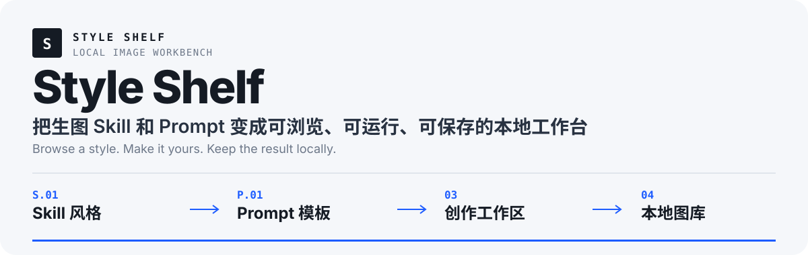
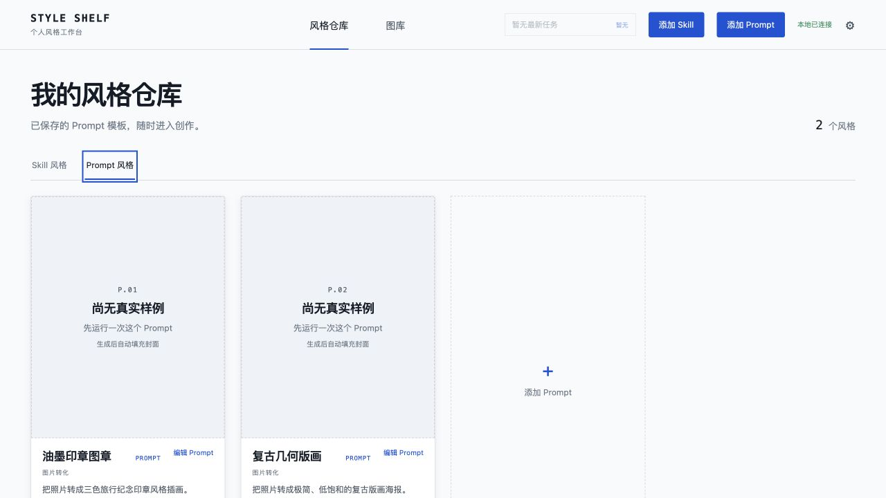
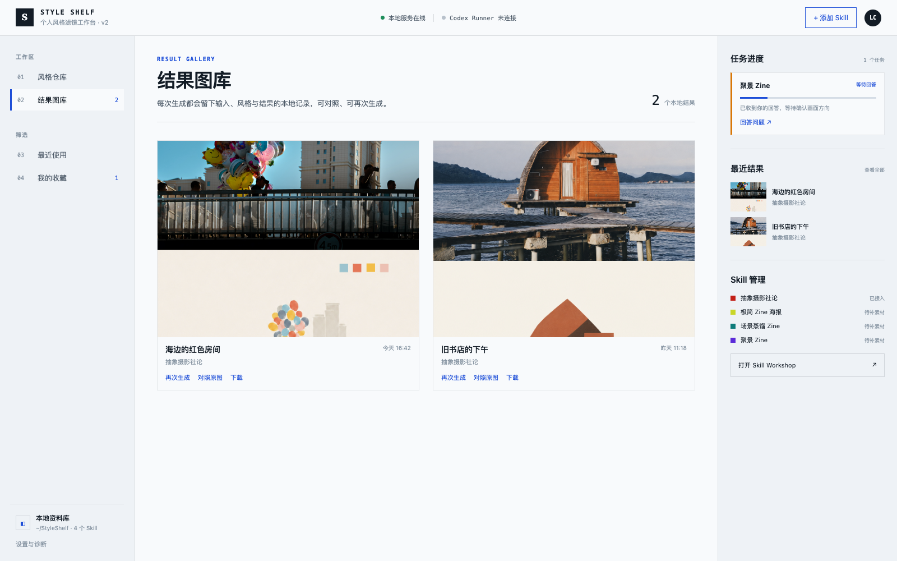

<p align="center">
  
</p>

<p align="center">
  <a href="https://github.com/logic0512/style-shelf/releases/latest"><strong>下载最新版</strong></a>
  · <a href="README.en.md">English</a>
  · <a href="#从源码运行">从源码运行</a>
  · <a href="THIRD_PARTY_NOTICES.md">第三方 Skill 与许可</a>
</p>

Style Shelf 是一个本地优先的图片风格工作台。它把生图 **Skill** 和固定风格 **Prompt 模板**整理成可视卡片，让选择风格、提供输入、生成图片、继续修改和保存结果都在同一个应用中完成。

> Style Shelf 不内置云端模型。真实生图默认需要已安装并登录的 Codex，或由你自行配置图像模型的 WorkBuddy。

## 真实界面

内置 Prompt 与用户保存的 Prompt 会进入独立分区；图片转化型和纯文本生成型使用同一套创作工作区。



生成结果统一进入本地图库，可继续生成、对照原图或下载。



## Style Shelf 做什么

- **按效果找风格**：用封面和说明浏览 Skill，不需要记住包名。
- **同时管理两种机制**：Skill 与 Prompt 分区保存、分区浏览，但共用创作工作区和图库。
- **适配不同输入**：根据来源显示图片、文字、多图、比例、选项或引导问答。
- **保留完整过程**：并行运行本地 Job，保留每轮结果，并在同一 Job 上继续修改。
- **本地保存作品**：原图与 `4:3` / `3:4` 展示封面分开保存，用户数据不会打进安装包。
- **安全管理 Skill**：可从 Codex Skill 目录导入或从 GitHub 安装；移出工作台不会删除原始 Skill。

## 工作流程

1. **选择来源** — 从 Skill 风格或 Prompt 风格中选择一张卡片。
2. **提供输入** — 按需要上传图片、填写文字，或两者都提供。
3. **本地执行** — 通过 Codex 运行；WorkBuddy 连接作为可选后端保留。
4. **保存结果** — 继续修改当前 Job，或把满意版本发布到本地图库。

## 快速开始

### 下载桌面版

前往 [最新 Release](https://github.com/logic0512/style-shelf/releases/latest)，选择对应系统：

- macOS：`mac-universal.dmg`，同时支持 Intel 与 Apple 芯片。
- Windows：`win-x64.exe`。
- Linux：`linux-x86_64.AppImage`。

当前安装包尚未签名或公证。macOS 可能需要在“系统设置 → 隐私与安全性”中允许打开，Windows 可能显示 SmartScreen 提示。

### 从源码运行

需要 Node.js `20.19+` 或 `22.12+`：

```bash
git clone https://github.com/logic0512/style-shelf.git
cd style-shelf
npm install
npm run bootstrap
npm run start
```

打开 <http://127.0.0.1:4173>。`bootstrap` 会初始化本地目录、补充缺失的内置 Skill 并运行环境诊断，不会覆盖已存在的同名 Skill。

常用命令：

```bash
npm run doctor
npm test
npm run build
npm run check:bundled-licenses
npm run desktop
```

## 执行方式与已知边界

### Codex（默认）

- 需要本机安装并登录 Codex，且当前账户具有可用的生图能力。
- Style Shelf 保存 Job、来源引用、输入副本和结果文件，不保存 Codex 登录凭据。
- v0.2.0 的 Prompt 流程已接入 Codex 执行路径。

### WorkBuddy（可选）

- 需要单独启动 WorkBuddy 本地 HTTP 服务，并在 WorkBuddy 内配置图像模型 API。
- 当前只完成连接与结果接收边界，尚未用可用的第三方生图 API 做端到端验证。
- 详见 [WorkBuddy 连接说明](docs/WORKBUDDY_CONNECTION_TEST.md)。

Prompt 模板保存在 `<data-dir>/prompts.json`，不会生成或修改 `SKILL.md`。服务默认只监听 `127.0.0.1`，仓库和安装包不包含用户图片、历史 Job、`.env` 或模型密钥。

## 默认 Skill 与许可

当前免费个人非商业包附带 8 个 Skill 风格，并内置两个 Prompt 测试模板。Style Shelf 核心代码为 MIT，但第三方 Skill 保留各自许可；完整默认包只适合免费个人／非商业使用。

<details>
<summary><strong>查看 8 个默认 Skill 的分发状态</strong></summary>

| Skill | 分发状态 | 许可摘要 |
| --- | --- | --- |
| `photo-abstract-editorial` | 随 App | 个人／教育／研究／非商业 |
| `ian-xiaohei-illustrations` | 随 App | MIT + NOTICE |
| `ink-wash-poster` | 随 App | AGPL-3.0 |
| `gc-minimal-zine-poster-v0-1` | 随 App | MIT |
| `scene-distillation-zine-v1-3` | 随 App | 个人非商业 |
| `scenes-gathered-zine-v1-3` | 随 App | 个人非商业 |
| `heytea-doodle-poster` | 随个人非商业版 | 上游再分发许可未核验；保留作者来源与限制 |
| `vinyl-image-generator` | 随 App | MIT |

</details>

`heytea-doodle-poster` 是维护者本地副本，不包含私有参考资产，也不代表作者授权商业再分发。完整来源与限制见 [`THIRD_PARTY_NOTICES.md`](THIRD_PARTY_NOTICES.md)。

## 本地存储与隐私

- 上传副本：`~/Pictures/Style Shelf/Uploads/`
- 生成原图：`~/Pictures/Style Shelf/Generated/`
- 内部 Job 与索引：Web 模式默认使用 `.styleshelf-data/`；App 模式使用系统用户数据目录。

路径可以通过 `.env` 覆盖，示例见 [`.env.example`](.env.example)。不要把 `.env`、登录信息或密钥提交到仓库。

## 更多文档

- [贡献说明](CONTRIBUTING.md)
- [隐私与凭据边界](docs/PRIVACY.md)
- [故障排查](docs/TROUBLESHOOTING.md)
- [Skill 元数据规则](docs/SKILL_METADATA_RULES.md)
- [WorkBuddy 连接与接口预留](docs/WORKBUDDY_CONNECTION_TEST.md)

## License

Style Shelf 应用代码使用 [MIT License](LICENSE)。第三方 Skill 受各自原始许可和 [`THIRD_PARTY_NOTICES.md`](THIRD_PARTY_NOTICES.md) 约束。
